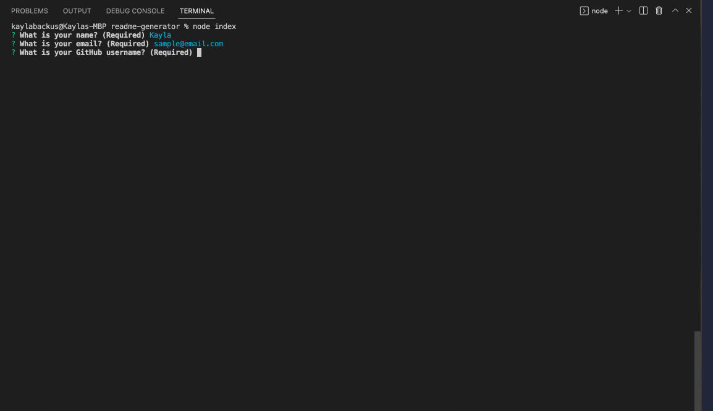
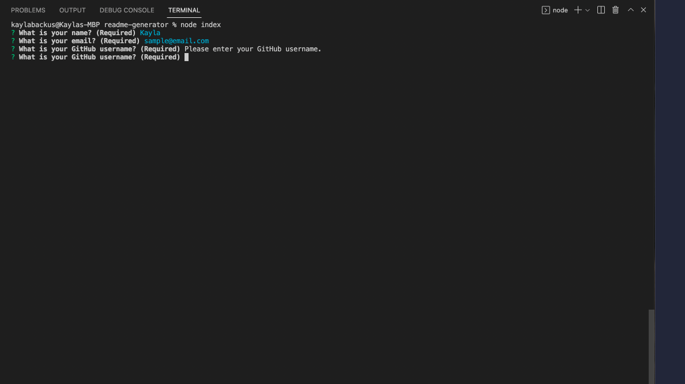
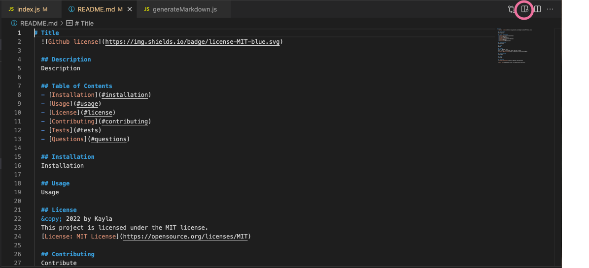
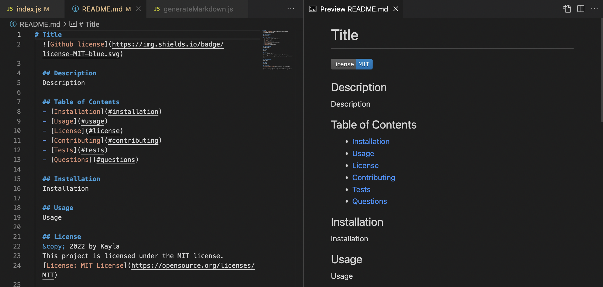

# README Generator
  

  ## Description
  This is a README.md file generator. Using the command line interface, the user answers questions about their project, which are printed to a README.md file.

  To view a walkthrough video, [click here](https://drive.google.com/file/d/1U0VeICmo9BY_nri80eM1BINggOqf4Ira/view?usp=sharing).

  ## Table of Contents
  - [Installation](#installation)
  - [Usage](#usage)
  - [License](#license)
  - [Contributing](#contributing)
  - [Tests](#tests)
  - [Questions](#questions)

  ## Installation 
  In order to install this project, the user must have Node.js installed on their local machine. [Click here](https://nodejs.org/en/download/) to download the LTS version Node.js for Windows (x64). [Click here](https://nodejs.org/en/download/) to download the LTS version of Node.js for macOS.
  
  Then, the user can clone the repository from GitHub using the command <samp>git clone git@github.com:kaylab78/readme-generator.git</samp> in their CLI. Then the user must install the [npm inquirer package](https://www.npmjs.com/package/inquirer). In the CLI, type the command <samp>npm install inquirer</samp>. Then, type <samp>node index</samp> to begin answering the questions for the README file.

  ## Usage 
  After the user installs the project and the necessary packages to execute the functions, the user types <samp>node index</samp> into their CLI. They are presented with a set of questions in their CLI. The answers that the user gives to these questions will be written to a README.md file that the user can implement for their project.
  

  All of the questions require answers. The questions that the user is asked are:
  - What is your name?
  - What is your email?
  - What is your GitHub username?
  - What is the title of your project?
  - Write a description for your project.
  - What are the installation instructions for your project?
  - Write the usage information for your project.
  - Choose a license for your project.
  - Write guidelines on how others can contribute to your project.
  - Write test instructions for your project.

  If the user doesn’t answer one of the questions, then a prompt shows on the CLI asking them to answer the question.
  

  ## License
  &copy; 2022 by Kayla Backus

  This project is licensed under the MIT license.

  [License: MIT License](https://opensource.org/licenses/MIT)

  ## Contributing 
  If a developer would like to contribute changes to this project, please open an issue to provide detailed information about the proposed change. When the developer is ready to contribute their own branch, they can submit a pull request. 
  
  ## Tests
  Since the result of this project (the README file) is built using Node.js and the CLI, in order to test if the functions are working, open the README.md file included with the project and open the preview window in VS Code.
  

  

  ## Questions 
  [github.com/kaylab78](https://github.com/kaylab78)
  
  [Email me](sample@email.com) with additional questions.